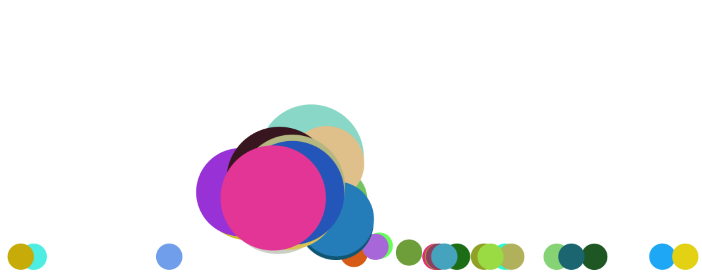

# Balls


## Overview
This project creates an interactive Balls using JavaScript and the HTML5 Canvas API. The balls react dynamically to mouse movements and clicks, offering a fun and visually appealing user experience. This project is designed as a sample to demonstrate canvas-based animation and interactivity.

## Prerequisites
- A modern web browser (Chrome, Firefox, Safari, etc.)
- Basic knowledge of JavaScript and HTML5 Canvas (optional)

## Installation
1. Clone the repository:
   ```bash
   git clone https://github.com/sajjad-sisakhtpour/balls.git
   ```
2. Navigate to the project directory:
   ```bash
   cd balls
   ```

## Usage
Open the `index.html` file in a browser to view and interact with the animation. The balls will bounce within the screen boundaries, and their size will increase or decrease in response to mouse movements and clicks.

## Examples
### Adding a Ball
Click anywhere on the canvas to add a new ball at the click position.

### Ball Growth and Shrinkage
Move the mouse near a ball to make it grow, and move it away to make it shrink.

## Documentation
- **Canvas API**: The project heavily utilizes the Canvas API to render and animate the balls.
- **Event Listeners**: Click and mouse move events are captured to make the animation interactive.

### Code Snippet
Here's a snippet showing how the `Ball` class is structured:
```javascript
class Ball {
  constructor(x, y) {
    this.br = 20;
    this.r = this.br;
    this.x = x || rnd(0 + this.r, screen.width - this.r);
    this.y = y || rnd(0 + this.r, screen.height - this.r);
    this.color = `rgb(${Math.random() * 255},${Math.random() * 255},${Math.random() * 255})`;
    this.dx = (Math.random() - 0.5) * 1;
    this.dy = Math.random() * 1;
    this.g = 0.04;
    this.f = 0.7;
    this.draw();
  }
  draw() { /* drawing code */ }
  update() { /* updating code */ }
}
```

## Contributing
1. Fork the repository.
2. Create a new branch (`git checkout -b feature/YourFeature`).
3. Commit your changes (`git commit -m 'Add some feature'`).
4. Push to the branch (`git push origin feature/YourFeature`).
5. Open a Pull Request.

## License
This project is licensed under the MIT License. See the [LICENSE](LICENSE) file for details.

## Contact
For questions or feedback, feel free to contact me:
- **Email**: [sajjad.sisakhtpour@gmail.com](mailto:sajjad.sisakhtpour@gmail.com)
- **GitHub**: [github.com/sajjad-sisakhtpour](https://github.com/sajjad-sisakhtpour)
- **LinkedIn**: [linkedin.com/in/sajad-sisakht-pour](https://ir.linkedin.com/in/sajad-sisakht-pour)

## Live Demo
Check out the live demo [here](https://sajjad-sisakhtpour.github.io/balls) (replace with actual link).

## Screenshots

